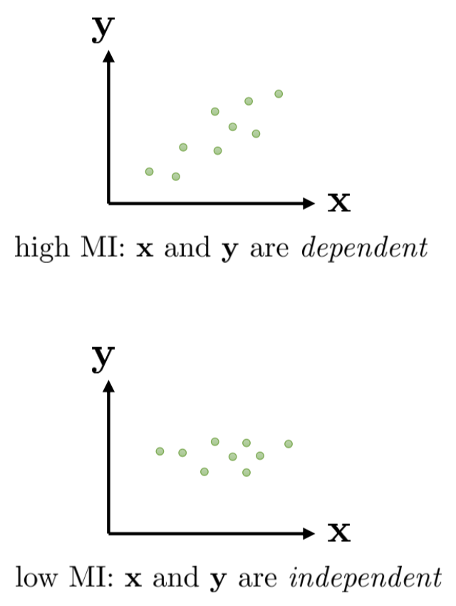
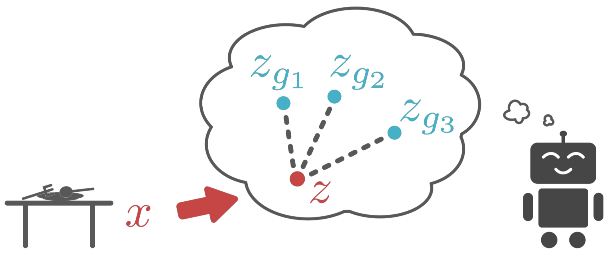

 

## Information-Theoretic Exploration, Challenges and Open Problems

### Lecture

1. Part 1: information theoretic exploration – how can we learn **without** any reward function at all?
2. Part 2: challenges and open problems in deep RL, takeaways and last-minute gift ideas

##### Goals:

- Provide high-level overview of information theoretic exploration and unsupervised reinforcement learning
- Briefly summarize tradeoffs of current deep RL algorithms
- Provide some perspective on current open problems and challenges

#### Unsupervised learning of diverse behaviors

What if we want to recover diverse behavior **without any reward function at all**?

Why?

- *Learn skills without supervision, then use them to accomplish goals* 
- *Learn sub-skills to use with hierarchical reinforcement learning*
- *Explore the space of possible behaviors*

#### An Example Scenario

How can you prepare for an **unknown** future goal?

training time: unsupervised

#### In this lecture...

➢Definitions & concepts from information theory  
➢Learning without a reward function by reaching goals   
➢Beyond state covering: covering the *space of skills*  
➢Using unsupervised reinforcement learning for meta-learning

#### Some useful identities

$$
\begin{array}{l}
p(\mathbf{x}) \quad \text { distribution (e.g., over observations } \mathbf{x}) \\ \\
\mathcal{H}(p(\mathbf{x}))=-E_{\mathbf{x} \sim p(\mathbf{x})}[\log p(\mathbf{x})] \\
\quad \text { entropy - how "broad" } p(\mathbf{x}) \text { is }
\end{array}
$$

$$
\begin{aligned}
\mathcal{I}(\mathbf{x} ; \mathbf{y}) &=D_{\mathrm{KL}}(p(\mathbf{x}, \mathbf{y}) \| p(\mathbf{x}) p(\mathbf{y})) \\
&=E_{(\mathbf{x}, \mathbf{y}) \sim p(\mathbf{x}, \mathbf{y})}\left[\log \frac{p(\mathbf{x}, \mathbf{y})}{p(\mathbf{x}) p(\mathbf{y})}\right] \\
&=\mathcal{H}(p(\mathbf{y}))-\mathcal{H}(p(\mathbf{y} | \mathbf{x}))
\end{aligned}
$$

#### Information theoretic quantities in RL

$\pi(\mathbf{s}) \quad$ state marginal distribution of policy $ \pi$   
$\mathcal{H}(\pi(\mathbf{s})) \quad$ state marginal entropy of policy $\pi$  <== quantifies *coverage*  
example of mutual information: "empowerment" (Polani et al.)  

$\mathcal{I}\left(\mathbf{s}_{t+1} ; \mathbf{a}_{t}\right)=\mathcal{H}\left(\mathbf{s}_{t+1}\right)-\mathcal{H}\left(\mathbf{s}_{t+1} | \mathbf{a}_{t}\right)$  
can be viewed as quantifying “control authority” in an information-theoretic way

#### Learn without any rewards at all

Nair*, Pong*, Bahl, Dalal, Lin, L. **Visual Reinforcement Learning with Imagined Goals**. ’18  
Dalal*, Pong*, Lin*, Nair, Bahl, Levine. **Skew-Fit: State-Covering Self-Supervised Reinforcement Learning.** ‘19

1. Propose goal: $z_{g} \sim p(z), x_{g} \sim p_{\theta}\left(x_{g} | z_{g}\right)$
2. Attempt to reach goal using $\pi\left(a | x, x_{g}\right),$ reach $\bar{x}$
3. Use data to update $\pi$
4. Use data to update $p_{\theta}\left(x_{g} | z_{g}\right), q_{\phi}\left(z_{g} | x_{g}\right)$  , goto 1

#### How do we get diverse goals?

standard MLE: $\theta, \phi \leftarrow \arg \max _{\theta, \phi} E[\log p(\bar{x})]$   
weighted MLE: $\theta, \phi \leftarrow \arg \max _{\theta, \phi} E[w(\bar{x}) \log p(\bar{x})]$   
$w(\bar{x})=p_{\theta}(\bar{x})^{\alpha}$   
key result: for any $\alpha \in[-1,0),$ entropy $\mathcal{H}\left(p_{\theta}(x)\right)$ increases!

what is the objective?   $\max \mathcal{H}(p(G))-\mathcal{H}(p(G | S))$ ,  G: goals get higher entropy due to Skew-Fit

what does RL do?  
$\pi(a | S, G)$ trained to reach goal  $G$  
as  $\pi$  gets better, final state  S  gets close to  G  
that means $p(G | S)$ becomes more deterministic!

$$
w(\bar{x})=p_{\theta}(\bar{x})^{\alpha}  \\
\alpha \in [-1,0)
$$

what is the objective?
$$
\max \mathcal{H}(p(G))-\mathcal{H}(p(G | S))=\max \mathcal{I}(S ; G)
$$
maximizing mutual information between $S$ and $G$ leads to  
	good exploration (state coverage) $-\mathcal{H}(p(G))$   
	effective goal reaching $-\mathcal{H}(p(G | S))$

