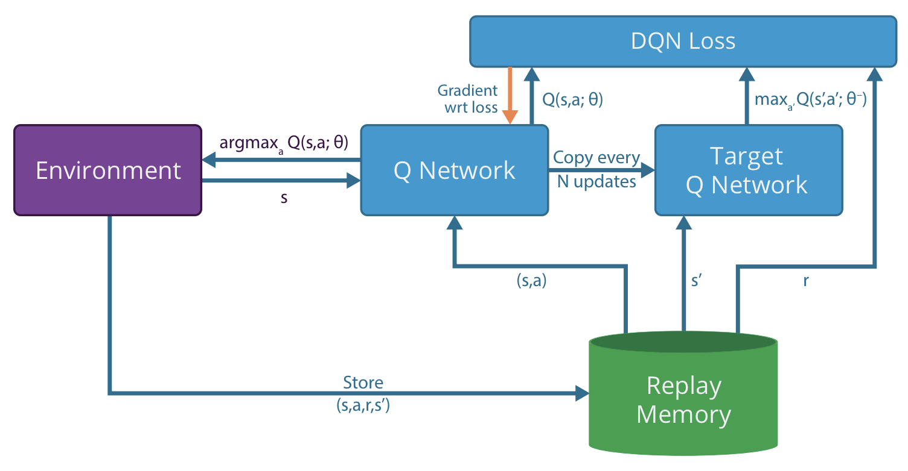
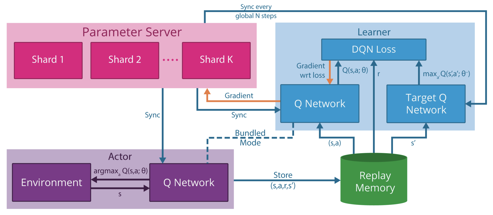

 

## Asynchronous Methods for Deep Reinforcement Learning

Deepmind提出的异步框架, 可以在多核CPU上跑.  同时, parallel actor-learners have a stabilizing effect on training.  异步框架更加稳定. 

#### Introduction

previously thought that the combination of simple online RL algorithms with deep neural networks was fundamentally unstable.   
These approaches share a common idea: the sequence of observed data encountered by an online RL agent is **non-stationary**, and on-line RL updates are strongly **correlated**.  
By storing the agent’s data in an **experience replay** memory, the data can be batched or randomly sampled from different time-steps. Aggregating over memory in this way reduces non-stationarity and decorrelates updates, but at the same time limits the methods to off-policy reinforcement learning algorithms.  
experience replay has several drawbacks: it uses more **memory** and **computation** per real interaction; and it requires off-policy learning algorithms that can update from data generated by an older policy.

1. 之前 online RL 不稳定. 提了一些稳定的方法. 
2. online数据不平稳non-stationary,  相关性太高.   
3. 用 **experience replay**  解决.  但这样就只能 off-policy
4. 采集到的数据可能是older policy生成.  并且每次交互, 更耗内存, 计算量. 

本文提出: Instead of experience replay, we asynchronously execute multiple agents in parallel, on multiple instances of the environment. This parallelism also decorrelates the agents’ data into a more stationary process, since at any given time-step the parallel agents will be experiencing a variety of different states. This simple idea enables a much larger **spectrum** of fundamental on-policy RL algorithms, such as Sarsa, n-step methods, and actor- critic methods, as well as off-policy RL algorithms such as Q-learning, to be applied robustly and effectively using deep neural networks.   
Whereas previous approaches to deep reinforcement learning rely heavily on specialized hardware such as GPUs  or massively distributed architectures, our experiments run on a single machine with a standard multi-core CPU.

1. 异步 multi agent 代替 experience replay ;  
2. data, 去相关, 更 stationary: 
3. 杂交出更多 on-poliy, off-policy 方法. 
4. 不用GPU,其他分布式架构,  多核CPU就可以
5. asynchronous advantage actor-critic (A3C) , discrete and continuous action space.

#### Related Work

**The General Reinforcement Learning Architecture (Gorila)** of (Nair et al., 2015) performs asynchronous training of reinforcement learning agents in a distributed setting. In Gorila, each process contains an actor that acts in its own copy of the environment, a separate replay memory, and a learner that samples data from the replay memory and computes gradients of the DQN loss with respect to the policy parameters. The gradients are asynchronously sent to a central parameter server which updates a central copy of the model. The updated policy parameters are sent to the actor-learners at fixed intervals. 

By using 100 separate actor-learner processes and 30 parameter server instances, a total of 130 machines, Gorila was able to significantly outperform DQN over 49 Atari games. On many games Gorila reached the score achieved by DQN over 20 times faster than DQN.

1. gorila 每个进程都有env, actor以及 buffer , learner . 
2. 定期异步的

