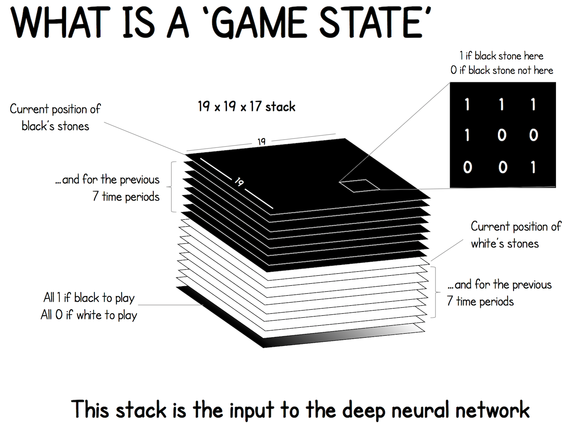
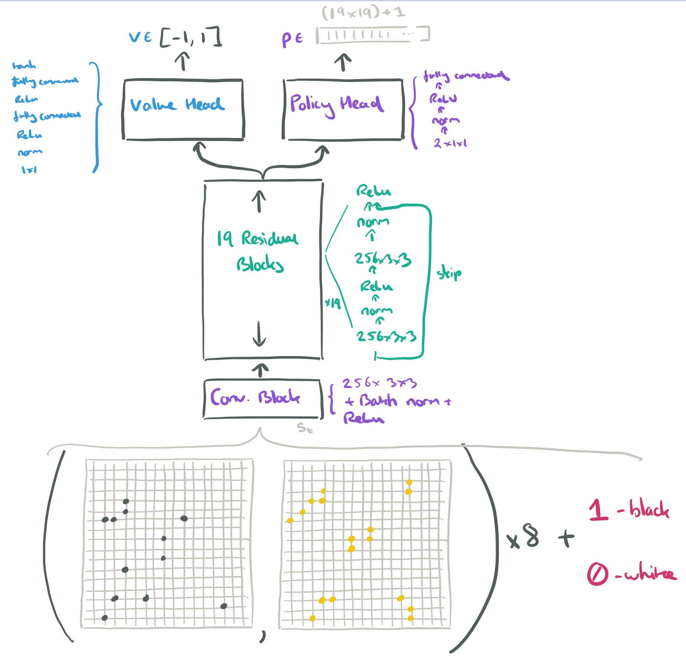

# AlphaGo Zero

## Mastering the game of Go without human knowledge

没有专家棋谱, 完全从zero开始.

AlphaGo Zero, 与AlphaGo Fan和AlphaGo Lee的差异: 

1. trained by self-play RL, starting from random play
2. 只使用棋盘盘面作为输入特征
3. 只使用一个NN
4. 使用了一个简化版 tree search,  没有Monte Carlo rollouts

#### Reinforcement Learning in AlphaGo Zero

- input : raw board representation s of the position and its history
- output : move probabilities and  value $(\mathbf{p}, v)=f_{\theta}(s)$
  - $p_{a}=\operatorname{Pr}(a \vert s)$ 
  - v , the probability of the current player winning from position s.
- policy and value 在一个网络架构中
- 网络由许多卷积层的residual blocks组成，具有batch normalisation和rectifier non-linearities

##### Self­play training pipeline

train NN :  self-play RL , use MCTS play each move.

1. NN initialized random weights $\theta_{0}$ 
   1. (Fig. 1a) , at iteration $i \geq 1$ ,  games of self-play are generated , plays a game $s_{1}, \ldots, s_{T}$ against itself
      1. at $t$ ,  MCTS search $\pi_{t}=\alpha_{\theta_{i-1}}\left(s_{t}\right)$ ,   play a move ~ sampling $\boldsymbol{\pi}_{t}$ 
      2. terminates at step $T$  ,  final reward of $r_{T} \in\{-1,+1\}$ 
      3. data for $t$  stored as $\left(s_{t}, \boldsymbol{\pi}_{t}, z_{t}\right)$ ,   $z_{t}=\pm r_{T}$ , 当前player角度
   2. (Fig. 1b) , in parallel,  train NN $\theta_{i}$ 
      1. data: 均匀采样 $(s, \boldsymbol{\pi}, z)$  
      2. $(\mathbf{p}, v)=f_{\theta}(s)$ ,  target  $(\boldsymbol{\pi}, z)$ 
      3. loss function  $l=(z-v)^{2}-\boldsymbol{\pi}^{\mathrm{T}} \log \boldsymbol{p}+c\|\theta\|^{2}$ ,  mse+CrossEntropy+L2

这里非常关键的一个点是, Loss函数跟之前的不一样; 这里重点利用了L2;  L2可以让参数均匀分布,防止过拟合. 

program plays a game $s_{1}, \ldots, s_{T}$ against itself. In each position $s_{t}$ an MCTS $\alpha_{\theta}$ is executed (see Fig. 2 ) using the latest neural network $f_{\theta} .$ Moves are selected according to the search probabilities computed by the MCTS, $a_{t} \sim \pi_{t} .$ The terminal position $s_{T}$ is scored according to the rules of the game to compute the game winner $z . \mathbf{b},$ Neural network training in AlphaGo Zero. The neural network takes the raw board position $s_{t}$ as its input, passes it through many convolutional layers with parameters $\theta$ and outputs both a vector $p_{t}$, representing a probability distribution over moves, and a scalar value $v_{t},$ representing the probability of the current player winning in position $s_{t}$. The neural network parameters $\theta$ are updated to maximize the similarity of the policy vector $p_{t}$ to the search probabilities $\pi_{t},$ and to minimize the error between the predicted winner $v_{t}$ and the game winner $z$ (see equation (1)). The new parameters are used in the next iteration of self-play as in a.

MCTS:

MCTS跟alphaGo的差不多一样. 

1. simulation 从root开始,  一直 select 最大化 **upper confidence bound** $Q(s, a)+U(s, a)$ , $U(s, a) \propto P(s, a) /(1+ N(s, a))$ 的边 ,  直到叶子节点 $s^{\prime}$ . 
2. 叶子节点, 展开, 并评估 $\left(P\left(s^{\prime}, \cdot\right), V\left(s^{\prime}\right)\right)= {f_{\theta}\left(s^{\prime}\right)}$ 
3. backup : simulation中遍历到的边, 都更新 $N(s, a)$ 和  $Q(s, a)=1 / N(s, a) \sum_{s^{\prime}\vert s, a \rightarrow s^{\prime} } V\left(s^{\prime}\right)$ 

MCTS 可以看做 self-play 算法.  给定 $\theta$ ,  根节点$s$,  输出action序列$\boldsymbol{\pi}=\alpha_{\theta}(s)$   
a的几率正比于 $\pi_{a} \propto N(s, a)^{1 / \tau},$   $\tau$ : temperature parameter. 

- MCTS search , 算某个 s  的  $\pi$
  - position $s$,  NN $f_{\theta}$ 引导 MCTS search , **output** :  probabilities $\pi$ of playing each move
  - MCTS 的 probabilities $\pi$  通常强于  $f_{\theta}(s)$ 的 $\mathbf{p}$  ,   从这个角度看是improve
  - MCTS 可以看成一个强大的 policy improvement operator.  **MCTS : PI算子**
- Self-play with search
  - using the improved MCTS­-based policy to select each move
  - using the game winner $z$ as a sample of the value
  - Self-play 可以被看成是强大的 policy evaluation operator. **Self-play : PE算子**
- policy iteration :  PI, PE, PI, PE,...
- $(\mathbf{p}, v)=f_{\theta}(s)$ ,  target  $(\boldsymbol{\pi}, z)$ ,  NN parameter update

#### Empirical analysis of AlphaGo Zero training

training: 

- 4.9 million games of self­play 
- 1,600 simulations for each MCTS, 0.4 s thinking time per move. 
- Parameters updated :  700,000 个 mini­batches(2,048)
- NN 20 residual blocks 

 $c$, Mean-squared error (MSE) of human professional game outcomes. MSE is between the actual outcome $z \in\{-1,+1\}$ and the NN value $v,$ scaled by $\frac{1}{4}$ to the range of $0-1$  .

训练36小时之后，AlphaGo Zero就超过了AlphaGo Lee，AlphaGo Lee训练了几个月。  
训练72小时后，AlphaGo Zero使用具有4个TPU的单机，而AlphaGo Lee则是分布在许多机器上，并且使用48个TPU。AlphaGo Zero以100比0击败AlphaGo Lee。

为了评估self­play RL相对于使用人类棋谱进行学习的优势，我们训练了第二个神经网络（使用相同的架构）来预测在KGS服务器数据，取得了与以前的工作相比更准确的预测准确度。监督学习SL取得了较好的初始性能，并且更好地预测了人类棋手的动作（图3）。值得注意的是，尽管SL获得了更高的棋步预测精度，但self­play的棋手总体上表现更好，在训练的前24 h内就击败了用人类数据进行训练的程序。这表明，AlphaGo Zero可能学习到一种与人类下棋有质的区别的策略。

SL里面也应该有过拟合, 并且从人类data出发,或造成探索的空间受限. 

separate (sep) or combined policy and value (dual) network

为了将结构architecture和算法algorithm的贡献分离，我们将AlphaGo Zero使用的NN architecture的性能与AlphaGo Lee进行了比较（见图4）。  
创建了四个NN，就像在AlphaGo Lee中那样，使用独立的策略网络和价值网络；或者使用AlphaGo Lee使用的卷积网络架构或AlphaGo Zero使用的残差网络架构。训练网络时都最大限度地减少相同的损失函数，使用的数据集是AlphaGo Zero在72小时的自我博弈训练后产生的固定数据集。  
利用**残差网络更准确**，使AlphaGo 达到较低的错误率和性能的改进，达到了超过600Elo。  
将策略和价值合成一个单一的网络会轻微地降低落子prediction accuracy，但降低了value error，并且使AlphaGo的性能提高大约600Elo。这部分由于提高了计算效率，但更重要的是 , **dual objective regularizes NN to a common representation that supports multiple use cases**. 

#### Knowledge learned by AlphaGo Zero

AlphaGo Zero在自我博弈训练过程中达到了围棋的新高度。  棋理方面.

#### Final performance of AlphaGo Zero

训练更强的 AlphaGo Zero的第二个实例。训练又从完全随机的行为开始，持续了大约40天。  
在训练过程中，产生了2900万场自我博弈。310万个minibatch(2048)。  
神经网络包含40个残差块.

通过内部比赛对AlphaGo Zero进行了评估，AlphaGo Master是基于本文所介绍的算法和架构，但使用了人类数据和特征的程序--在2017年1月的在线比赛中，我们以60-0击败了最强的人类职业棋手。  
评估中，所有的程序都被允许每一步棋的思考时间为5s；AlphaGo Zero和AlphaGo Master分别在4个TPU的单机上下棋；AlphaGo Fan和AlphaGo Lee分别分布在176个GPU和48个TPU上。还包括了一个完全基于AlphaGo Zero的原始神经网络的棋手；这个棋手只是简单地选择了概率最大的棋子。

100 games, AlphaGo Zero  89 ,   11 AlphaGo Master

#### Conclusion

我们的结果全面证明了纯强化学习方法是完全可行的，在没有人类指导的情况下，就可以训练到超人的水平。此外，与基于人类专家数据的训练相比，纯粹的强化学习方法只需要几个小时的训练时间，就可以获得更好的渐近性能。使用这种方法，AlphaGo Zero以很大的优势击败了之前最强的AlphaGo版本。
人类积累的围棋知识，在短短几天的时间里，AlphaGo Zero就重新发现了其中的大部分围棋知识，以及提供了新策略。

### Supplementary

#### Methods

##### Reinforcement learning

Policy iteration  理论部分,  主要讨论MCTS的意义

**Classification­-based reinforcement learning** **improves** the policy using a simple **Monte Carlo search**. Many **rollouts** are executed for each action; the action with the **maximum mean value** provides a positive training example, while all other actions provide negative training examples; **a policy is then trained to classify actions as positive or negative, and used in subsequent rollouts.** This may be viewed as a precursor to the policy component of AlphaGo Zero’s training algorithm when $\tau \to 0$.    
这里,  rollout 即 扮演了 生成sample的角色,  然后 select action 时, 选了max,  所以相当于一个 greedy improve; 下面网络拟合Fit ,  即是evaluate也是improve的过程;  
 **MC rollout + NN** , 所以对Fit , data improve, net improve

**classification­ based modified policy iteration (CBMPI)**, also performs **policy evaluation** by regressing a value function towards truncated rollout values, similar to the value component of AlphaGo Zero; this achieved state­-of­-the­-art results in the game of Tetris. However, this previous work was limited to **simple rollouts** and **linear function approximation** using **hand­ crafted features**.  三个短板

The AlphaGo Zero **self­play** algorithm can similarly be understood as an **approximate policy iteration** scheme in which **MCTS** is used for both policy improvement and policy evaluation. Policy improvement starts with a neural network policy, executes an MCTS based on that policy’s recommendations, and then <u>projects the (much stronger) search policy back into the function space of the neural network</u>. <u>Policy evaluation is applied to the (much stronger) search policy</u> : the outcomes of self­play games are also projected back into the function space of the neural network. These projection steps are achieved by training the neural network parameters to match the search probabilities and self­play game outcome respectively.  
MCTS 算子 ,  ??  Policy improve:  NN Policy  *  MCTS  = NN + ,  Policy evaluation:  selfplay games data, (search probabilities, outcome) , fit 也是映射到NN+  ;   PI部分有点说不通    
MCTS 保存着N和Q 

Guo et al.7 also project the output of MCTS into a neural network, either by regressing a value network towards the search value, or by classifying the action selected by MCTS. This approach was used to train a neural network for playing Atari games; however, the MCTS was fixed—there was no policy iteration—and did not make any use of the trained networks.   之前别人做的,  MCTS产出 (p, v) 用来fit. 

#### Domain knowledge

1. AlphaGo Zero被提供了完美的博弈规则知识  
   These are used during MCTS, to simulate the positions resulting from a sequence of moves, and to score any simulations that reach a terminal state. Games terminate when both players pass or after 19 × 19 × 2 = 722 moves. In addition, the player is provided with the set of legal moves in each position.
2. AlphaGo Zero uses Tromp–Taylor scoring during MCTS simulations and selfplay training.
3. The input features describing the position are structured as a 19 × 19 image
4. 围棋的规则在旋转和reflection下是不变的；这一知识在AlphaGo Zero中得到了很好的应用，既可以在训练时对数据集进行扩容，将每个位置的旋转和reflection都包括在内，也可以在MCTS过程中对位置的随机旋转或反射进行采样(见搜索算法)

MCTS也没有使用任何其他启发式或特定领域的规则来增强。没有任何合法的棋步被排除----即使是那些填入棋手自己的eyes的棋步（这是以前所有程序中使用的标准启发式）。

MCTS search parameters were selected by Gaussian process optimization, so as to optimize selfplay performance of AlphaGo Zero using a neural network trained in a preliminary run. For the larger run (40 blocks, 40 days), MCTS search param eters were reoptimized using the neural network trained in the smaller run (20 blocks, 3 days). The training algorithm was executed autonomously without human intervention.

#### Neural network architecture

这次的输入也非常的干净.   
19×19×17 features.  The last feature is the color of the stone to play now.  

其他也有用 resnet 训练围棋的, 不过只是 SL, 输出只有policy.

#### Neural network architecture comparison

- dual–res: contains a 20 block residual tower, followed by both a policy head and a value head.  used in **AlphaGo Zero**.
- sep–res: two 20 block residual towers. The first tower is followed by a policy head and the second tower is followed by a value head.
- dual–conv: a nonresidual tower of 12 convolutional blocks, followed by both a policy head and a value head.
- sep–conv: the network contains two nonresidual towers of 12 convolutional blocks. The first tower is followed by a policy head and the second tower is followed by a value head. used in **AlphaGo Lee**.

都是用的selfplay数据训练. 超参用的SL里面的. Each network was trained on a fixed dataset containing the final 2 million games of selfplay data generated by a previous run of AlphaGo Zero, using stochastic gradient descent with the annealing rate, momentum and regularization hyperparameters described for the supervised learning experiment; however, crossentropy and MSE components were weighted equally, since more data was available.

#### Evaluation 评估标准

Elo 评分标准.

leaf node $s_{L}$ at time-step $L$. At each of these time-steps, $t<L,$ an action is selected according to the statistics in the search tree, $a_{t}=\arg \max \left(Q\left(s_{t}, a\right)+U\left(s_{t}, a\right)\right)$ using a variant of the PUCT algorithm $^{24}$,
$$
U(s, a)=c_{\text {puca }} P(s, a) \frac{\sqrt{\Sigma_{b} N(s, b)}}{1+N(s, a)}
$$
where $c_{\text {puct is a constant determining the level of exploration; this search control }}$ strategy initially prefers actions with high prior probability and low visit count, but asympotically prefers actions with high action value. Expand and evaluate (Fig. $2 b$ ). The leaf node $s_{L}$ is added to a queue for neural network evaluation, $\left(d_{i}(\boldsymbol{p}), v\right)=f_{\theta}\left(d_{i}\left(s_{L}\right)\right),$ where $d_{i}$ is a dihedral reflection or rotation selected uniformly at random from $i$ in $[1.8] .$ Positions in the queue are evaluated by the neural network using a mini-batch size of $8 ;$ the search thread is locked until evaluation completes. The leaf node is expanded and each edge $\left(s_{L}, a\right)$ is initialized to $\left\{N\left(s_{L}, a\right)=0, W\left(s_{L}, a\right)=0, Q\left(s_{I}, a\right)=0, \widetilde{P}\left(s_{I}, a\right)=p_{a}\right\} ;$ the value $v$ is then backed up.
Backup (Fig. $2 \mathrm{c}$ ). The edge statistics are updated in a backward pass through each step $t \leq L$. The visit counts are incremented, $N\left(s_{t}, a_{t}\right)=N\left(s_{t}, a_{t}\right)+1,$ and the action value is updated to the mean value, $W\left(s_{t}, a_{t}\right)=W\left(s_{t}, a_{t}\right)+v, Q\left(s_{t}, a_{t}\right)=\frac{W\left(s_{t}, a_{t}\right)}{N\left(s_{t}, a_{t}\right)}$
We use virtual loss to ensure each thread evaluates different nodes $^{12,69}$. Play (Fig. 2d). At the end of the search AlphaGo Zero selects a move $a$ to play in the root position $s_{0},$ proportional to its exponentiated visit count, $\pi\left(a | s_{0}\right)=N\left(s_{0}, a\right)^{1 / \tau} / \sum_{h} N\left(s_{0}, b\right)^{1 / \tau},$ where $\tau$ is a temperature parameter that controls the level of exploration. The search tree is reused at subsequent time-steps:
the child node corresponding to the played action becomes the new root node; the subtree below this child is retained along with all its statistics, while the remainder of the tree is discarded. AlphaGo Zero resignsifits root value and best child value are lower than a threshold value $v_{\text {resign: }}$

Compared to the MCTS in AlphaGo Fan and AlphaGo Lee, the principal differences are that AlphaGo Zero does not use any rollouts; it uses a single neural network instead of separate policy and value networks; leaf nodes are always expanded, rather than using dynamic expansion; each search thread simply waits for the neural network evaluation, rather than performing evaluation and backup asynchronously; and there is no tree policy. A transposition table was also used in the large (40 blocks, 40 days) instance of AlphaGo Zero.  

The input features $s_{t}$ are processed by a residual tower that consists of a single convolutional block followed by either 19 or 39 residual blocks $^{4}$. The convolutional block applies the following modules:
(1) A convolution of 256 filters of kernel size $3 \times 3$ with stride 1
(2) Batch normalization $^{18}$
(3) A rectifier nonlinearity

## Reference

Mastering the game of Go without human knowledge  http://augmentingcognition.com/assets/Silver2017a.pdf

AlphaGo Zero — a game changer.  https://medium.com/@jonathan_hui/alphago-zero-a-game-changer-14ef6e45eba5

AlphaGo Zero Explained In One Diagram https://medium.com/applied-data-science/alphago-zero-explained-in-one-diagram-365f5abf67e0

network pic from https://blog.acolyer.org/2017/11/17/mastering-the-game-of-go-without-human-knowledge/