# NFSP

核心要点:   基于 Self-play

 **(Normal) FP  => (Extensive) XFP(全遍历) , FSP(tabular) , NFSP(NN)**

**realization-equivalent** 

**平均策略 += 针对别人平均策略的BR ,  可收敛到 纳什均衡.** 

**Generalised Weakened Fictitious play 保证 近似BR即可收敛.**

求BR 用RL;  AS += BR, 用ML , **对采样的分布有要求.**      ML reservoir sampling

**NFSP= RL + ML + FSP**

## Fictitious play 

**Fictitious play** is a method defined by George W. Brown in 1951, it consists of zero sum game and each player plays the **best response** to his opponent strategy. 

Fictitious method is proven to **converge to the theoretical game value (V)**. It is also proven that the Fictitious Play **converges to Nash equilibrium in two-player zero-sum game**.

Fictitious play（FP）是一种经典的**基于self-play**的博弈论模型。玩家维持两个策略：**平均策略（average strategies）**和**最优反应策略（best response)** , 每个玩家在对局中不断的采取针对对手平均策略求解**最优反应策略**，则其**平均策略**在两人零和游戏中（如二人德州扑克）**收敛**至纳什均衡。

最优反应是在**对手策略固定**的情形下，能够获得最大收益的策略。 这里的br的求解方式是求的纯策略的BR. 求近似纳什均衡策略并不容易, 但在知道这个近似均衡策略的情况下, 针对其求BR相对容易求, 用tabular的方法, 只需要遍历一遍game tree. 

##### 博弈论里怎么算 Fictitious Game

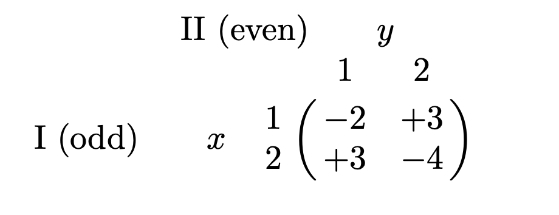

这个问题可以用解析法来解决，优势在玩家I身上，如果他平均下 "1 "的概率为7/12，而下 "2 "的概率为5/12，那么他将平均获利1/12

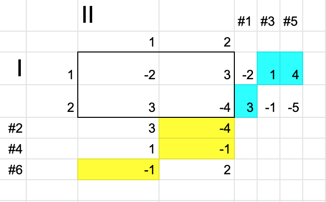

1. 第一次, B随便选一个策略比如1, 将该列记在右边
2. A知道B选 1, 则A选2, 将该行记到下面
3. B知道A选2, 则B选2,  将该列加和到最右边
4. A知道B选2, 则A选1 , 将该行加和到最下面 ..
5. 以此类推,  A,B选择是根据最后一行或者列里面的最大或最小值决定的, 一直做下去, 则会收敛到game value.

一般步骤:   知道最后会收敛就行. 

1. 选择一个列，在网格的右侧 记下 整个列的值。
2. 选择 上列中最大值的ROW，在网格的底部 记下该行的值。
3. 选择  上面一行ROW中的最小值， 将所属列COLUMN的值加到右边，写上SUM。
4. 选择  上面一列COLUMN中的最大值，将所属行加到底部的值上，写上sum。
5. 根据需要，重复步骤3和4。
6. 计算下限(L)和上限(U): 将最后选择的值除以迭代次数，计算出下限 和上限。L≤V≤U。

##### Fictitious Play 算法

At each iteration

1. Compute a best response to opponents' average strategies.     **BR vs AS**

2. Update own average strategy with computed best response.     **AS += BR**
   $$
   \Pi_{k+1} \in \Pi_{k}+\frac{1}{k+1}\left(\mathrm{B} \mathrm{R}\left[\Pi_{k}\right]-\Pi_{k}\right)
   $$

这里可以看出, 下面的extensive的FP,   $$\alpha$$ 最好取 $$1/T$$ , 因为最后要求得的是平均策略, **平均策略收敛**. 

**Fictitious Play 主要针对 nomal form 博弈, 怎么应用到  extensive form**

因为 FP 是针对 normal form的 , 所以需要把 extensive 的策略转为 normal form的.  

先讨论 extensive form策略转为normal form策略会出现的问题.     
FP算法, 需要两个策略相加, 但extensive form的策略怎么相加.

纯策略指,在各种情况下都有着明确的各种action对应, 不是随机的, 即选择某个action的概率是1, 所以可以看成是一个向量, index是状态的id, 值是action_id; 也可以看成一个策略树; mix则是这些纯策略上的概率分布,  是纯策略这些向量的概率组合,  相当于之前的策略树的每个节点都会随机选一些action. 但也有一些情况:

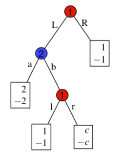

这个是作为一个反例, 玩家2一直选b , 玩家1就是两个纯策略,  (L,l) 和  (R,r) 都可以得到收益 是1 , 但两者的加权混合策略 (1-p)(L,l)+p(R,r),  收益为 (1-p)(1-p+ pc)+p

即整个策略树直接加权求和 不行,   需要对每个节点都区分开, 考虑到达该点的概率再加权求和;  

#### realization-equivalent

对于(R,r)这个纯策略, 虽然P1在第二个state, 肯定选r, 但由于第一步选了R, 根本不会走到第二个状态. 所以对某个node, 其**到达概率**也是很关键的.  所以对一个action在某个node被选择的几率, 是从root开始自顶而下计算, 求得 到达该state的概率, 再乘以 选action的概率 . 即 **realization probabilities**, 记为$$x(\sigma)$$ 

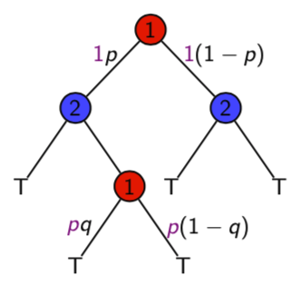

Theorem 2.2.2 (Von Stengel, 1996). Two strategies are **realization equivalent** if and only if they have the same realization plan.  即两个策略等价, 是说他们有一样的计划, 即遇到每个情况,都采用一样的策略.

下面这个重要, 将extensive的博弈的策略等价到normal form.

**Kuhn’s Theorem** (Kuhn, 1953) links extensive-form, **behavioural strategies** with (realization-equivalent) normal-form, mixed strategies.

Theorem 2.2.3 (Kuhn, 1953). For a player with perfect recall, any mixed strategy is **realization equivalent** to a **behavioural strategy**, and vice versa.

Two strategies are **realization-equivalent** iff for any opponent strategies they define the same probability distribution over the states of the game.  

正则博弈策略（指mixed strategy）和扩展式博弈策略（指behavior strategy）是等价的 realization-equivalent. 

加权求和 这些behaviour的 realization-equivalent  策略, 是可行的.

显然, 两个策略的加权求和, 凸组合, 不是对每个节点简单的两个策略相加, 要考虑到两个策略对该节点分别的到达概率, 然后在其基础上进行加权. 所以下面的公式比较重要.

##### Lemma

Given

- $$\pi$$ and $$\beta$$  two behavioural strategies
- $$\Pi$$ and $$B$$ two mixed strategies
- $$\Pi$$ and $$B$$ are realization equivalent to $$\pi$$ and $$\beta$$

Then

$$
\mu(u)=\pi(u)+\alpha\left[\frac{x_{\beta}\left(\sigma_{u}\right)}{(1-\alpha) x_{\pi}\left(\sigma_{u}\right)+\alpha x_{\beta}\left(\sigma_{u}\right)}\right](\beta(u)-\pi(u)) , \quad \forall u \in \mathcal{U}
$$

这样看更清楚:  对game tree的每个节点, 都要先把总的到达概率算出来作为分母, 然后再根据  到达概率 $$x(\sigma)$$  $\times$ 策略的$\pi$  来计算.

$$
\mu(u)=  \left[\frac{\alpha   x_{\beta}\left(\sigma_{u}\right)}{(1-\alpha) x_{\pi}\left(\sigma_{u}\right)+\alpha x_{\beta}\left(\sigma_{u}\right)}\right] \beta(u)   + \left[\frac{(1-\alpha) x_{\pi}\left(\sigma_{u}\right)}{(1-\alpha) x_{\pi}\left(\sigma_{u}\right)+\alpha x_{\beta}\left(\sigma_{u}\right)}\right] \pi(u) , \quad \forall  u \in \mathcal{U}
$$

is **realization-equivalent** to

$$
M=\Pi+\alpha(B-\Pi) \\
M= (1 - \alpha) \Pi+\alpha B
$$

## Extensive-Form Fictitious Play (XFP)

下面将 normal form 的FP 扩展到   extensive form 的XFP 

 其次，FP针对的是正则博弈问题，也就是类似与剪刀石头布的one-step问题，但是现实中大部分博弈问题都不是正则博弈问题，因此，FP的使用受到了限制。

因为是迭代求解, 所以每次的BR都是ε-Best , 放宽best reponse 的求解精度，使用近似的best reponse

##### ε-Best Response

Consider R to be the reward for the best response.   
ε-best response as the set of responses that result in rewards  $$r$$ such that $$r ≥ R-ε$$.

##### Generalised Weakened Fictitious play

Definition 2.2.4 A **generalised weakened fictitious play** is a sequence of **mixed strategies**, $$\left\{\Pi_{k}\right\}, \Pi_{k} \in \times_{i \in \mathscr{N}} \Delta^{i}$$     s.t.

$$
\Pi_{k+1}^{i} \in\left(1-\alpha_{k+1}\right) \Pi_{k}^{i}+\alpha_{k+1}\left(\mathrm{BR}_{\varepsilon_{k}}^{i}\left(\Pi_{k}^{-i}\right)+M_{k+1}^{i}\right), \quad \forall i \in \mathscr{N}
$$

with $$\alpha_{k} \rightarrow 0$$ and $$\varepsilon_{k} \rightarrow 0$$ as $$k \rightarrow \infty, \Sigma_{k=1}^{\infty} \alpha_{k}=\infty,$$ and $$\left\{M_{k}^{i}\right\}$$ sequences of **perturbations** that satisfy, for any $$T>0$$

$$
\limsup _{k \rightarrow \infty}\left\{\left\|\sum_{j=k}^{l-1} \alpha_{j+1} M_{j+1}^{i}\right\| \text { s.t. } \sum_{j=k}^{l-1} \alpha_{j+1} \leq T\right\}=0, \quad \forall i \in \mathscr{N}
$$

GWFP 保证 带扰动的 策略也可以收敛

Theorem 4.4.1. Let $$\pi_{1}$$ be an initial behavioural strategy profile. The extensive-form process

$$
\begin{aligned}
\beta_{t+1}^{i} & \in \mathrm{B} \mathrm{R}_{\varepsilon_{t+1}}^{i}\left(\pi_{t}^{-i}\right) \\
\pi_{t+1}^{i}(u) &=\pi_{t}^{i}(u)+\frac{\alpha_{t+1} x_{\beta_{t+1}^{i}}\left(\sigma_{u}\right)}{\left(1-\alpha_{t+1}\right) x_{\pi_{t}^{i}}\left(\sigma_{u}\right)+\alpha_{t+1} x_{\beta_{t+1}^{i}}\left(\sigma_{u}\right)}\left(\beta_{t+1}^{i}(u)-\pi_{t}^{i}(u)\right)
\end{aligned}
$$

for all players $$i \in \mathscr{N}$$ and all their information states $$u \in \mathscr{U}^{i}$$ ,  with $$\alpha_{1} \rightarrow 0$$ and $$\varepsilon_{t} \rightarrow$$ 0 as $$t \rightarrow \infty,$$ and $$\sum_{t=1}^{\infty} \alpha_{t}=\infty,$$ is realization-equivalent to a **generalised weakened fictitious play** in the normal-form and thus the **average strategy profile converges to a Nash equilibrium** in all games with the fictitious play property.

非常重要的定理, 只要扰动后面越来越小, 则近似的BR代入迭代也可以收敛. 

At each iteration

1. Compute an **approximate** best response to opponents' average strategies

2. Update own **average strategy** with computed best response, allowing for some kinds of **perturbations**
  
   $$
   \Pi_{k+1} \in \Pi_{k}+\alpha_{k+1}\left(\mathrm{BR}_{\epsilon_{k+1}}\left[\Pi_{k}\right]-\Pi_{k}+M_{k+1}\right)
   $$

第1步是计算 一个近似BR , 需要使用 DP

第2步是 Knowledge transfer

**Extensive Form Fictitious Play** employs the concept of the **generalised weakened fictitious play**, to compute iteratively **compute the Nash Equilibrium**, so in two-player zero-sum game, **XFP converges**.

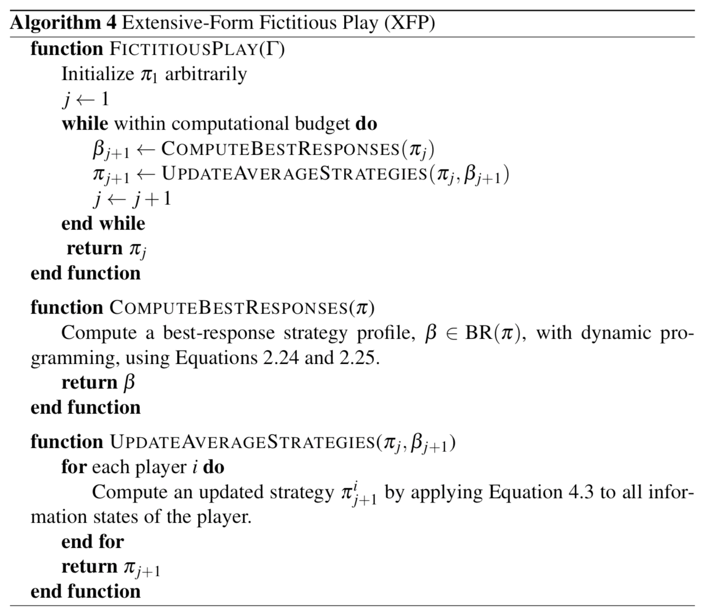

XFP的问题:

1. Full-width fictitious play在游戏的**所有状态**下执行计算，无论这些状态是否可能发生。   
   抽样可集中在**相关**状态
2. 对大型博弈，单次迭代的全宽度fictitious play 成本过高   
   Function approximator 可以在不同状态之间进行泛化
3. state空间比information state 空间大。  
   Learning agents只在information state 上运行

## Fictitious Self Play

下面要解决的问题是 XFP 需要在整个树上计算 , 虽然能保证收敛, 但是太慢.  能不能通过**采样来近似**, 去获取一个近似纳什均衡策略. 

**Fictitious play in extensive-form games XFP**

- Computation linear in time and space rather than exponential   对state空间是线性关系
- Preserve convergence guarantees  保证收敛

由此得出  FSP 算法.  **Fictitious Self-Play**

- Experiential and sample-based approximation of fictitious play 
- Leverages machine learning

XFP 的问题:

1. XFP是一种全宽度的方法，受制于维度诅咒。在每一次迭代中，计算需要在博弈的所有状态下进行，无论其**相关性**如何。 generalised weakened fictitious play 理论上保证了, 只要 近似的BR, 就可以收敛.
2. XFP 与 FA 不兼容, 不能泛化 .  所以算法设计者只能手工设计Abstraction. 

FSP解决方案:

1. 用近似的、基于样本的学习方法取代了XFP的全宽策略和行动值更新。
2. 用FA来表示他们的策略和行动值估计，而不是使用表格查找表示。

近似BR是通过强化学习基于 针对对手的平均策略的experience 来学习。  
平均策略更新可以被表述为一个监督学习任务，每个玩家学习一个自己行为的transition model。

关于RL以及ML的考虑,  如果都用了值函数的方式, 但一个策略的值函数是相当于环境的,如果相对于对手, 则是会变化的,需要对手的策略是稳定的.  但这样学出来的值,  是不具有一般性的. 所以这里的ML,学习的是action的prob. 利用泛化;   RL是可以使用值函数的方法, 因为环境就是自己的平均策略,还算稳定.

### Best Response Learning ,  RL学习BR

1. 首先将fictitious play的迭代分解为 MDP序列. 
2. 然后考虑 用什么策略,   sample experience:  off-policy
3. off-policy learning from such experience, 需要设计一个内存结构
4. RL学到的BR的质量

这里与之前有一个很大的不同的点, 之前都是通过 DP 直接求解出来BR, 没有交互 ,所以对agent的当前的策略没要求. 

1. 迭代求解近似BR的过程,可以被视为 求一个MDP的近似最优解的过程, 通过RL在相应MDP的experience的samples上面学习.  简单的说,  当对手的策略都固定的时候, 那就构成了一个稳态的env , 那么求解BR就是一个最大化收益的过程, 可以用RL,  这个时候,自己用的什么初始策略无所谓, 只要不断通过与当前对手交互的experience来学习.  这时玩家i的策略要保证足够的探索性, 当然也可以用 off-policy的Q-learning, 自带探索. 

2. agent i 想用如Q-learnig得到BR.  理论上, 因为BR是最优对策, 所以近似BR 也差不多是Q-learning 迭代到近似收敛才行.  即 $$\beta^i = \varepsilon-greedy(Q^i)$$  ;   
   如采用 on-policy的方式,  可以让 agent i执行当前的(上一轮留下的)BR policy  against $$\pi^{-i}$$ , 再不断迭代policy evaluation , policy improvement, 最终可以学到一个近似BR ;  
   如采用off-policy, 则让所有agents 执行平均策略$$\pi$$ , 同时self-play , 采样experience到buffer. 然后用off-policy RL方法求近似BR  
   下面采用 off-policy, batch方法 ,  采样agent的两种策略, average strategy profile $$\pi_{k}$$  和 $$\left(\beta_{k+1}^{i}, \pi_{k}^{-i}\right)$$ ,  存到 replay memory, $$\mathscr{M}_{R L}^{i}$$ , $$\left(u_{t}, a_{t}, r_{t+1}, u_{t+1}\right)$$ 

3. FIFO ,  sliding window , s 是内存大小 , 所以相当于是 s个采样的平均
  
   $$
   \mathscr{M}_{R L}^{i} \approx \frac{1}{s+1} \sum_{k=t-s}^{t} \mathscr{M}\left(\pi_{k}^{-i}\right)
   $$
   
   玩家的平均策略, 随时间变化比较平稳: 
   
   $$
   \lim _{t \rightarrow \infty} \frac{1}{s+1} \sum_{k=t-s}^{t} \Pi_{k}=\Pi_{t}
   $$
   
   memory’s windowing大小的影响比较有限:
   
   $$
   \frac{1}{s+1} \sum_{k=1-s}^{t} \mathscr{M}\left(\pi_{k}^{-i}\right) \rightarrow \mathscr{M}\left(\pi_{t}^{-i}\right) \text { for } t \rightarrow \infty
   $$

4. generalised weakened fictitious play 允许 $$\varepsilon_{k}$$ -best responses, 但需要 $$\varepsilon_{k} \rightarrow 0$$ as $$k \rightarrow \infty$$ . 

   对fictitious play 的 MDP sequence, 可以利用realization-equivalent.  k时刻的平均策略可以是两个混合策略的组合. $$\Pi_{k}=\left(1-\alpha_{k}\right) \Pi_{k-1}+\alpha_{k} B_{k} $$ .  因此, 双人game,  MDP $$\mathscr{M}\left(\pi_{k}^{-i}\right)$$ is structurally equivalent to  MDP that initially picks between $$ \mathscr{M}\left(\pi_{k-1}^{-i}\right)$$  and  $$\mathscr{M}\left(\beta_{k}^{-i}\right)$$ with probability $$\left(1-\alpha_{k}\right)$$ and $$\alpha_{k}$$ respectively. 可以 transfer knowledge. 

   

   有个定理, Proposition 5.3.1. 说明了如果对手的平均策略质量较差, 则RL能学到的最优策略也是有上限的.   (full-width) XFP的鲁棒性的实验中，XFP 由于噪声较大质量差的最佳响应 , 得到质量较低的策略。
   
   因为RL是向着BR去学习的, 而BR是针对对手政策的, 对手政策越差, 则可利用性越高, 得到的BR风险性也越高.

##### Learning a strategy update

Learn

$$
\Pi_{k}^{i}=\left(1-\alpha_{k}\right) \Pi_{k-1}^{i}+\alpha B_{k}^{i}
$$

by sampling data (state-action pairs) from

$$
\left\{\begin{array}{ll}
\pi_{k-1}^{i} & \text { with prob. } 1-\alpha_{k} \\
\beta_{k}^{i} & \text { with prob. } \alpha_{k}
\end{array}\right.
$$

against some fixed, fully mixed opponent sampling policy, e.g. $$\pi_{k-1}^{-i}$$

### Average Strategy Learning  ML学习平均策略

1. 转为监督学习, 采样的target 是啥,  平均策略,  过去所有的迭代中的Br的平均
2. 怎么采样 Experience
3. 内存模型, 因为内存有限
4. 近似的效果

  

#### 采样的target

player i  想学 behavioural strategy $$\pi$$ ,  而 $$\pi$$  realization-equivalent等价于normal-form策略的凸组合 $$\Pi=\sum_{j=1}^{k} w_{j} B_{j}$$ .  所以等价于从一个策略为$$\Pi$$ 的model 的样本上学习.

behavioural strategy $$\pi^{i}$$  可以近似的从 trajectories的数据集上学习,  sampled from $$\left(\Pi^{i}, \mu^{-i}\right)$$  .  $\mu^{-i}$ 是对手的策略.   可以将 sample from $$\Pi=\sum_{k=1}^{n} w_{k} B_{k}$$  拆解为 sampling whole episodes from each constituent $$\beta_{k}^{i} \equiv B_{k}^{i}$$ with probability $$w_{k}$$ .  

#### 如何采样 Experience

1. In fictitious play, our **goal** is to keep track of the **average mixed strategy profile** : 目标是平均策略.
  
   $$
   \Pi_{k+1}=\frac{1}{k+1} \sum_{j=1}^{k+1} B_{j}=\frac{k}{k+1} \Pi_{k}+\frac{1}{k+1} B_{k+1}
   $$
   
   Both $$\Pi_{k}$$ and $$B_{k+1}$$ are available at iteration $$k$$  and we can sample experience of a behavioural strategy $$\pi_{k+1}^{i}$$ that is realization equivalent to $$\Pi_{k+1}^{i} . \quad$$ 

2. In particular, for a player $$i$$ we would repeatedly sample episodes of him following his strategy $$\pi_{k+1}^{i}$$ against a **fixed**, completely mixed strategy profile of his opponents, $$\mu^{-i} .$$  

   Note, that player $$i$$ can follow $$\pi_{k+1}^{i}$$ by choosing between $$\pi_{k}^{i}$$ and $$\beta_{k+1}^{i}$$ at the root of the game with probabilities $$\frac{k}{k+1}$$ and $$\frac{1}{k}$$ respectively and committing to his choice for an entire episode. 

   data近似策略, 可以被FA学习. 

   为了不重新采样数据集, 而是增量更新数据集. 而且需要无偏. 所以增量的数量要固定.    Instead of resampling a whole new data set of experience at each iteration, we can incrementally update our data set from a stream of best responses, $$\beta_{j}^{i}, j= 1, \ldots, k$$ . In order to constitute an **unbiased approximation of an average of best responses**, $$\frac{1}{k} \Sigma_{j=1}^{k} B_{j}^{i}$$  ,  we need to accumulate the same number of sampled episodes from each $$B_{j}^{i}$$ and these need to be sampled **against the same fixed opponent strategy profile** $$\mu^{-i}$$.   自己是增量Br策略, 对手必须一直是固定的某个策略.如果是平均策略则肯定是随迭代而变化的.  
   但使用平均策略也是可行的.  However, we suggest using the average strategy profile $$\pi_{k}$$ as the (now varying) sampling distribution $$\mu_{k} .$$ Sampling against $$\pi_{k}$$ has the benefit of focusing the updates on states that are more likely in the current strategy profile. When collecting samples incrementally, the use of a changing sampling distribution $$\pi_{k}$$ can introduce bias. However, in fictitious play $$\pi_{k}$$ is changing more slowly over time and thus it is conceivable for this bias to decay over time as well.  取样 against $$\pi_{k}$$ 的好处是将更新集中在当前策略组合中更有可能出现的状态上。当逐渐收集样本时，使用不断变化的抽样分布 $$\pi_{k}$$ 会带来偏差。然而， $$\pi_{k}$$ 随着时间的推移变化较慢，因此可以想象这种偏差也会随着时间的推移而衰减。

#### Memorizing Experience 如何存

##### table-lookup counting model

记忆过去的策略经验的方法很简单，但可能很昂贵，那就是统计每个动作的次数。对每个采样到的(s,a) 记录选择的次数.

$$
N\left(s_{t}^{j}, a_{t}^{i}\right) \leftarrow N\left(s_{t}^{i}, a_{t}^{i}\right)+1 \\
\forall a \in \mathscr{A}\left(s_{t}\right): \pi\left(s_{t}, a\right) \leftarrow \frac{N\left(s_{t}, a\right)}{N\left(s_{t}\right)}
$$

##### reservoir sampling

对大规模问题，在所有信息状态下跟踪动作计数是不可行的。要用有限容量, 需要使用 reservoir sampling。    

​		

**vanilla Reservoir sampling**  :  用于从一个 无限多项 的数据流中跟踪一个有限的随机样本，$$\left\{x_{k}\right\}_{k \geq 1}$$  。假设一个reservoir（内存）, $$\mathscr{M}$$ ,  大小为$$n$$  .      
前 $$n$$ 次迭代,  所有的样本 $$x_{1}, \ldots, x_{n},$$直接加入reservoir    
第 $$ k>n$$ 次, 样本$$x_{k}$$,  以几率 n/k 从reservoir中随机挑一项替换掉, 否则直接丢弃 $$x_{k}$$ .  
因此，对于任何一个迭代轮次 $$k$$，reservoir 包含了一个 所有样本$$\left\{x_{k}\right\}_{k \geq 1}$$ 的  uniform random sample. 

**Exponential reservoir sampling**  :  k>n时,  替换概率, 有一个下限p,  如 $$\max \left(p, \frac{n}{k}\right)$$ , 因此, 一旦 $$k=\frac{n}{p}$$ 个item被采样以后,  则p就发挥主导作用,  item留在在reservoir的几率就是(1-p)/n 的指数. 

添加agent的 近似BR experience到各自的reservoir , $$\mathscr{M}_{S L}$$ ;    
如使用vanilla reservoir sampling,  得到一个近似的 $$\alpha= \frac{1}{T}$$的步长的 fictitious play, T 是 iteration counter  
如使用Exponential reservoir sampling,  step size是 $$\max \left(\alpha, \frac{1}{T}\right)$$ , where $$\alpha$$ 取决于reservoir的大小以及最小替换几率p. 

##### Average Strategy Approximation

把 average strategy profile $$\Pi_{k}=\frac{1}{k} \sum_{j=1}^{k} B_{j}$$ 的近似记为 $$\tilde{\Pi}_{k}^{i}$$ ,   从 BR 的数据流 $$B_{k}, k \geq 1$$ 上 用 counting model 完美采样,  然后学习.    显然样本数 随着k变大, 近似误差越小 , $$\tilde{\Pi}_{k}^{i}-\Pi_{k}^{i}$$ .  但是 近似误差 可能有偏, 因为$$B_{k+1}$$ 是针对 $$\tilde{\Pi}_{k}$$ 训练出来的.  而generalised weakened fictitious play 只要求 渐近最优, asymptotically-perfect best responses , 这可能使得收敛速度减慢到不可接受.

### 具体算法

FSP可以通过多种方式来实现，例如，可以**on- or off-policy**，也可以**online or batch**。关键的想法是，两个fictitious play，即 **RL计算BR** 和  **SL更新 average strategy**。具体使用哪种机器学习方法，可根据领域的需求进行定制。但关键的是，确保agent从适当的经验中学习是至关重要的。

每次迭代中,   依次对每个玩家, 计算BR,  更新AS

##### Batch

batch变体, 将  采样并填内存 与  从内存中学习 隔离开. 

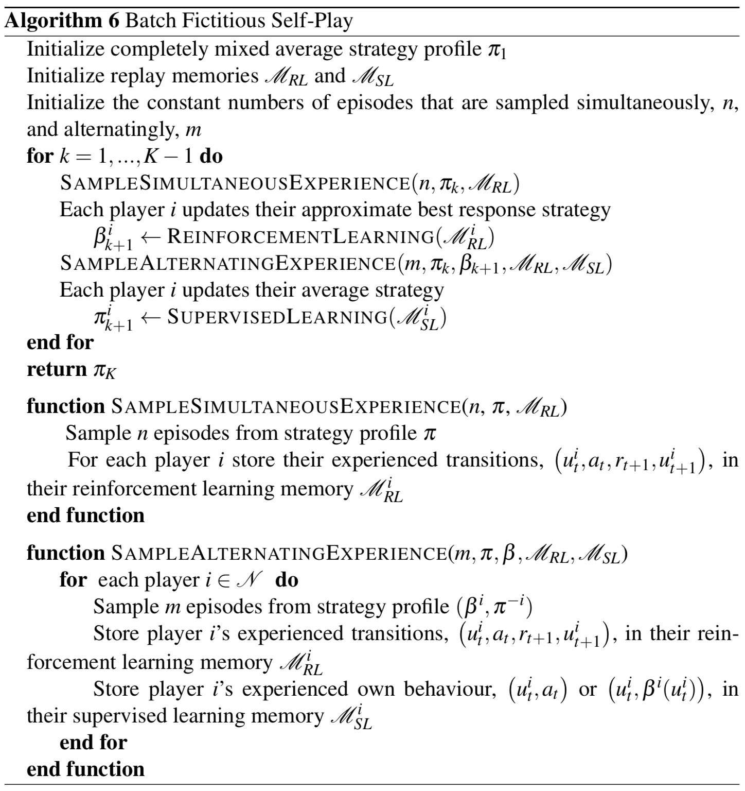

每次迭代中,  **n个玩家一起play采样**,  先RL采样, 然后每个玩家 off-policy RL学习BR,  再AS+BR 采样, SL 学习更新 AS. 

上面算法里面, 为什么ML阶段也有数据到RL的memory中, 因为RL需要的就是 transition.  剩下的按比例采样到SL的memory.

##### Table-lookup

这个batch版本,内存用了 counting model,   RL用了Q-learning,   

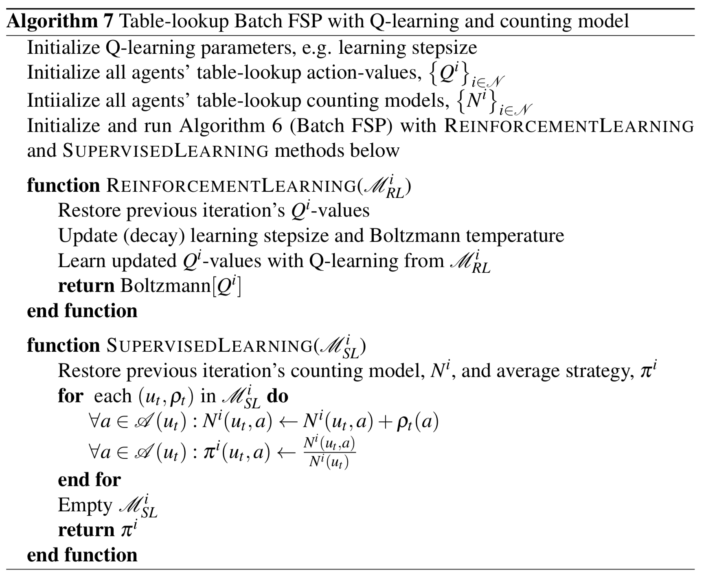

### 实验

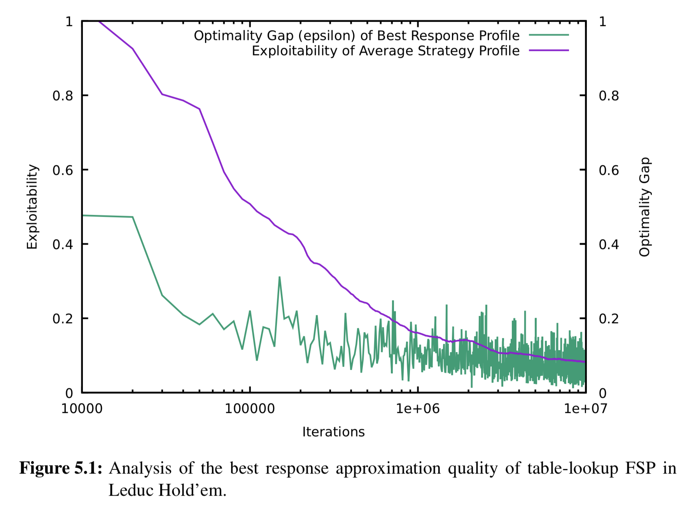

由于我们在每次迭代中使用了固定的计算预算，这表明知识确实在迭代之间进行了转移。看来，Q-learning可以跟上它所针对学习 learns against 的变化较慢的average strategy profiles 。

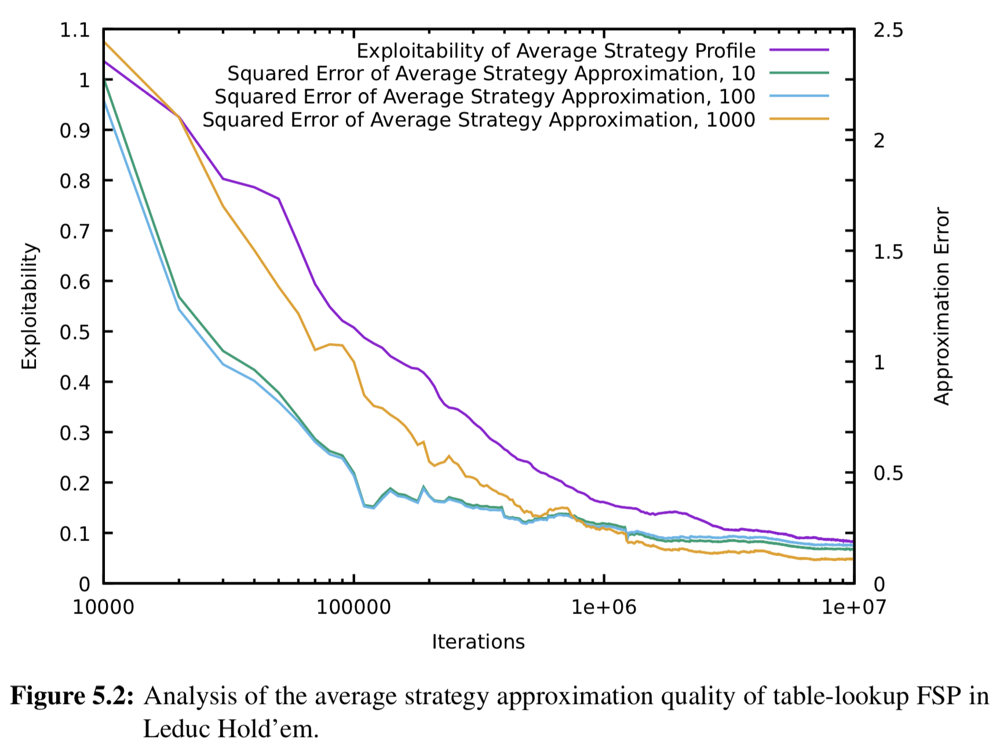

由于累加的BR是样本是有限的, 所以会有 得到的近似平均策略可能是质量不高的 担忧. 所以研究了近似误差. target是一个完美平均策略, 由XFP产生的BR 算出来平均策略.  FSP产出的AS, 计算间隔分别是10,100,1000次迭代计算一次 .  可以看成, 可以从采样的experience中学到 平均策略.

##### Sample-Based Versus Full-Width 采样与全遍历

测试了算法7FSP在每次迭代的固定计算资源下的性能，并评估了它与XFP相比在更大的游戏中的扩展性。

实验是 Leduc Hold’em , River poker

虽然XFP在小的6张牌的变种中明显优于FSP，但在60张Leduc Hold'em中，XFP的学习速度更慢。这可能是意料之中的，因为XFP的每一次迭代的计算量在牌数的平方上呈线性增长。另一方面，FSP只对信息状态进行操作，而信息状态的数量与牌数呈线性关系。

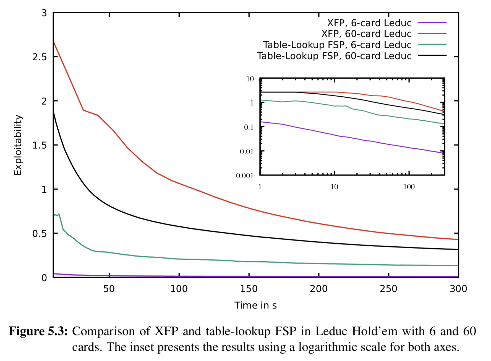

River poker有大约1000万个状态，但信息状态只有4000个左右。出于与Leduc Hold'em实验中类似的原因，这也许可以解释FSP的整体性能更好。此外，游戏的结构为游戏的每个状态分配了非零概率，因此XFP的计算成本对于River poker的两个实例都是一样的。它在每个状态下执行计算，无论发生的概率有多大，它都会执行计算。另一方面，FSP则是以采样为指导，因此它能够将计算的重点放在可能发生的情况上。这使得它能够从玩家的信念引入游戏中的额外结构中获益。

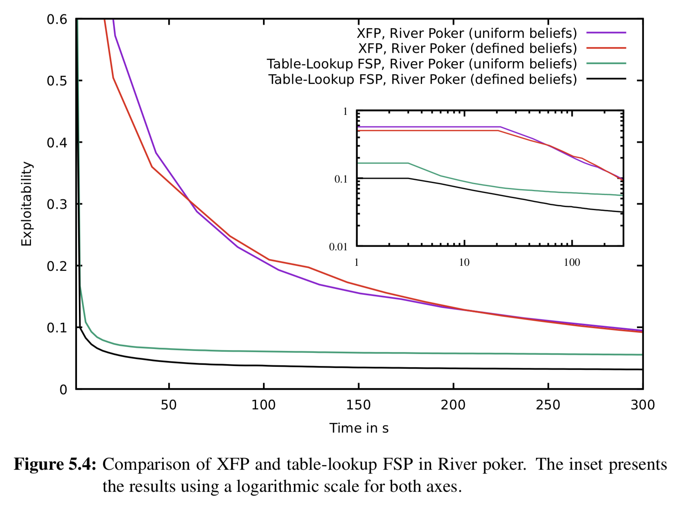

## NFSP

NFSP = NN + FSP , 上面都是用的tabular.

#### Simultaneous Learning 同步学习

之前的batch FSP算法6 需要一个元控制器，协调FSP agent，使其适当地采样experience.  如果单个agent能够从其非协调的 交互的同步经验中自主地学习一个纳什均衡，那就非常实用.  同时, 同步采样而不是交替的, 会提升采样效率n倍.

如果所有的agents learn simultaneously while playing against each other, 那面临的问题: 原则上，每个agent 都该使用其平均策略，$$\pi$$，并通过off-policy Q-learning来学习一个BR.   Qnet学到的BR: evaluate and maximise  $$Q^{i}(s, a) \approx \mathbb{E}_{\beta^{i}, \pi^{-i}}\left[G_{t}^{i} | S_{t}=s, A_{t}=a\right]$$ .   
然而，在这种情况下,       agent不会产生任何关于自身BR的behaviour，$$\beta^i$$ ,  用于训练其平均策略$$\pi^i$$，即近似 过去的平均BR。

Q-learning 怎么生成其自身的 experience , 因为RL需要在其自身的策略上改进,  即 β = ε-greedy(Q), 要求得 β , 需要用当前的Q网络的策略交互.  如果用平均策略, 即过去 β 的平均, 则该策略是来自 ML网络的.

为解决这个问题, 提出 approximation of **anticipatory dynamics** of continuous-time dynamic fictitious play.  在这个fictitious play变体中, 玩家先 在其他对手的平均策略之上做一个 短期的预测short-term: $$\Pi_{t}^{-i}+\eta \frac{d}{dt} \Pi_{t}^{-i}$$, where $$\eta \in \mathbb{R}$$ is the **anticipatory parameter**.  对于依赖具体游戏的 $$\eta$$ 的合理选择，可以提高均衡点的fictitious play的稳定性。我们使用$$B_{k+1}^{i}-\Pi_{k}^{i} \approx \frac{d}{d k} \Pi_{k}^{i}$$   作为anticipatory dynamics中使用的导数的的近似。   一阶近似. 

**anticipatory dynamics** 可以使学习动态目标更加稳定。在一般的多人游戏中，这意味着向混合策略纳什均衡收敛。核心思想是将**预期修正anticipated correction** 引入到行动中。最简单的理解是，想象一下向一个移动的目标射击, 通过瞄准目标前方一定距离的目标进行射击修正。

#### Online FSP Agent

Online FSP Agent, **online** reinforcement learner for **simultaneous FSP** with **anticipatory dynamics** . 

Online FSP agents 服从的策略为 $$\sigma \equiv(1-\eta) \Pi+\eta B$$ , 使得每个agent可以计算出一个近似的BR, $$\beta^{i}$$,   针对其他玩家的策略组合, $$\sigma^{-i} \equiv \Pi^{-i}+\eta\left(B^{-i}-\Pi^{-i}\right) $$ . 

此外，由于每个agent的BR现在被采样（与anticipatory parameter成比例），现在可以从经验中学习他们的平均策略。Algorithm 8介绍了一个通用的Online FSP代理，可以用各种强化和监督学习方法实例化。

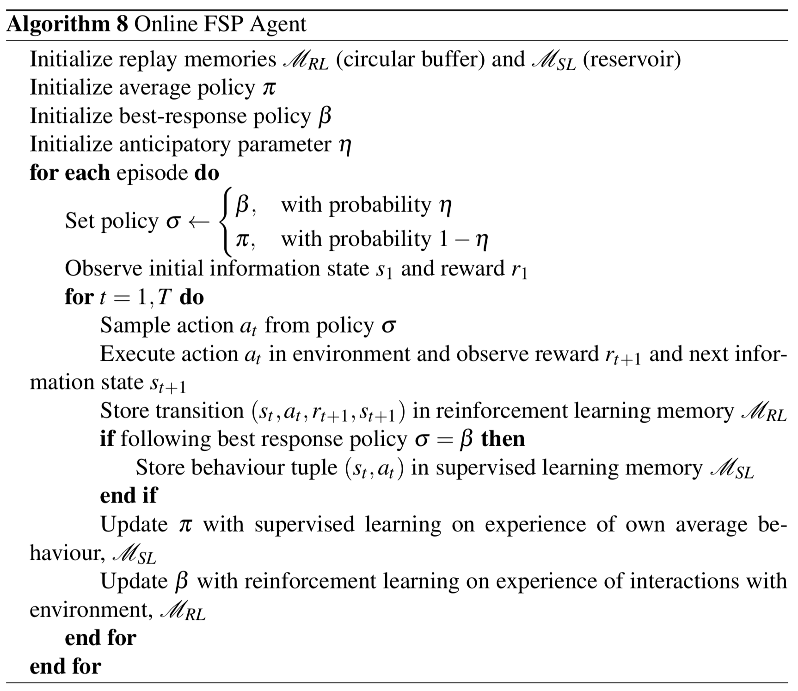

#### Neural Fictitious Self-Play

NFSP 部署了单独的 deep-learning Online FSP Agents ，来实现 multi-agent  self-play.  

**Deep Learning Best Responses** :  直接用DQN: learn an ε-greedy policy by **deep fitted Q-learning** from **replayed experience** .

$$
\mathscr{L}\left(\theta^{Q}\right)=\mathbb{E}_{\left(s, a, r, s^{\prime}\right) \sim . A_{R L}}\left[\left(r+\max _{d^{\prime}} Q\left(s^{\prime}, a^{\prime} ; \theta^{Q^{\prime}}\right)-Q\left(s, a ; \theta^{Q}\right)\right)^{2}\right]
$$

approximate best response strategy:

$$
\beta=\varepsilon \text { -greedy }\left[Q\left(\cdot ; \theta^{Q}\right)\right]
$$

**Deep Learning Average Strategies** :  

agent的平均策略由NN,  $$\Pi\left(s, a ; \theta^{\Pi}\right)$$ 表示，将状态映射到Softmax的行动概率。通过模仿过去最近BR的逻辑回归来训练网络. 使用SGD on the negative log-probability of past actions taken. 

$$
\mathscr{L}\left(\theta^{\Pi}\right)=\mathbb{E}_{(s, a) \sim \mathscr{M}_{S L}}\left[-\log \Pi\left(s, a ; \theta^{\Pi}\right)\right]
$$

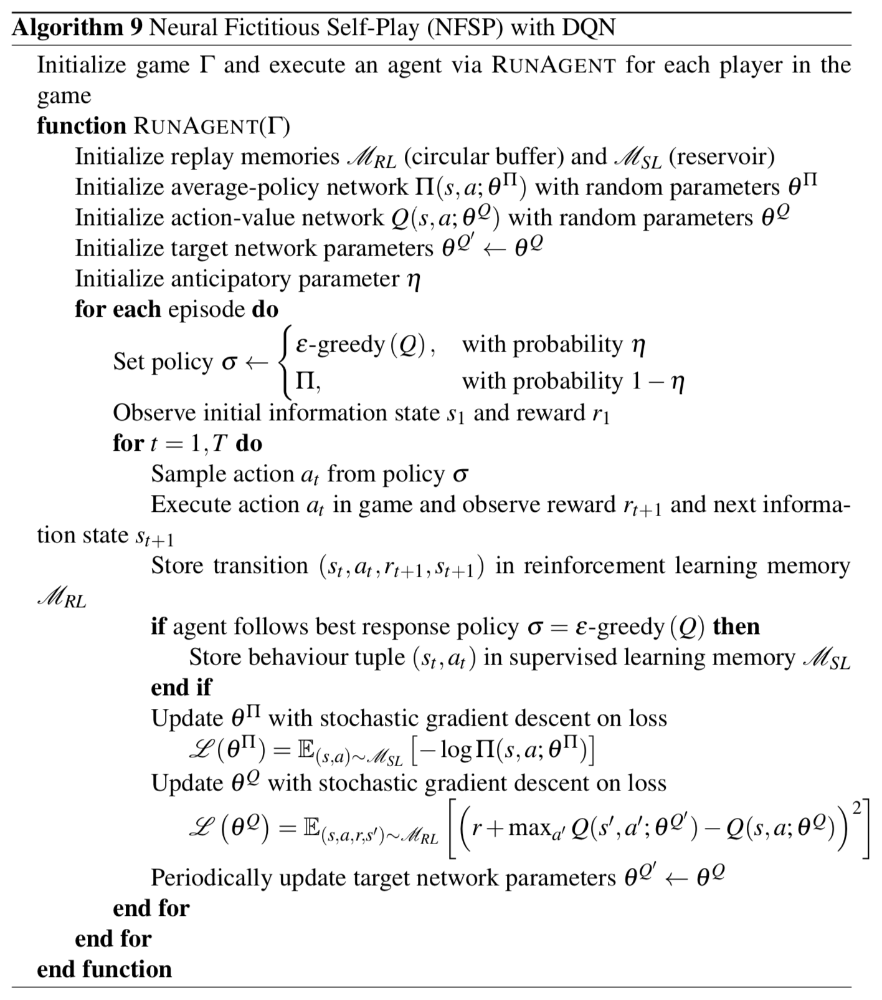

#### 实验

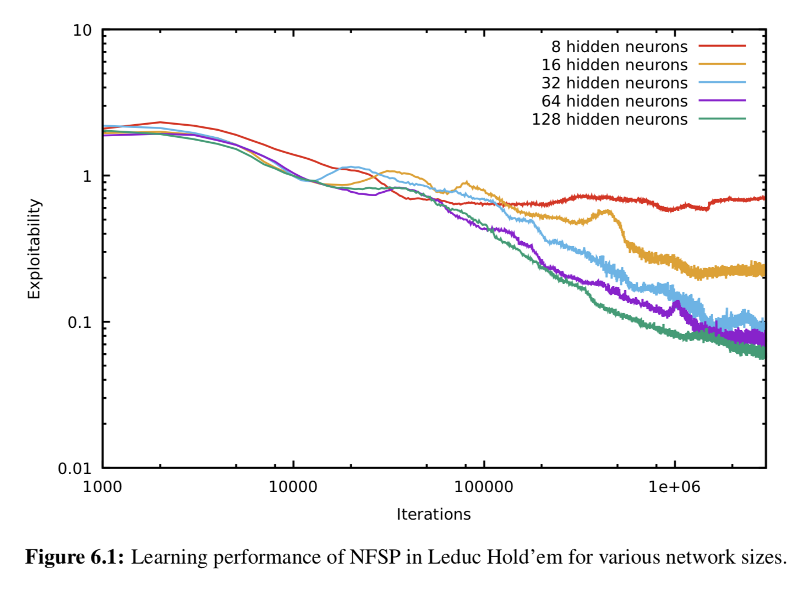

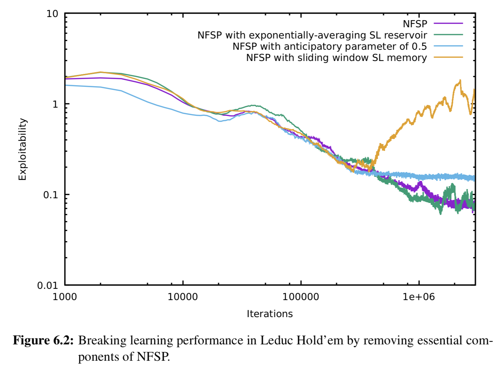

研究NFSP的各个组成部分的相关性, 图6.2显示，  
使用固定尺寸的 sliding window 造成了发散.    
NFSP的性能在0.5的高anticipatory parameter下最后变平了，这很可能违反了game-dependent stability conditions of dynamic fictitious play (Shamma and Arslan, 2005)  
最后，使用exponentially-averaged reservoir sampling进行监督学习更新导致了噪声性能。

DQN learns a deterministic, greedy strategy, 可以满足behave optimally in single-agent domains. 但对信息不完全的env, 一般需要策略是随机的,才能获得最优.  下面验证, DQN的average behaviour能否收敛到纳什均衡.  使用一个 SL memory 来扩充 DQN , 训练一个神经网络来估计其平均策略.  与NFSP不同的是，平均策略不会以任何方式影响agent的行为；它是被动地观察DQN agent，以估计其随时间的演变。我们通过使用NFSP来实现DQN的这种变体，其anticipatory parameter为η = 1。

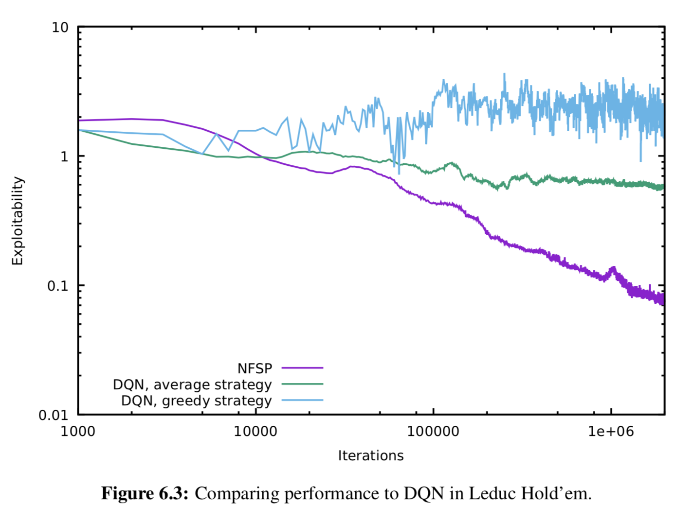

图6.3显示DQN的确定性策略具有很高的可利用性，这是可以预期的，因为不完全信息游戏通常需要随机策略。DQN的平均行为也没有接近纳什均衡。原则上，DQN也会根据对手agents产生的历史经验学习一个最佳反应。那么，为什么它的表现比NFSP差呢？问题在于，DQN代理完全根据ε-greedy策略产生自我博弈经验。这些经验在时间上都是高度相关的，而且高度集中在一个狭窄的状态分布上。与此相反，NFSP代理使用一个越来越缓慢变化的（预期）平均策略来产生self-play经验。因此，他们的经验变化更平稳，从而产生更稳定的数据分布，从而使神经网络更稳定。注意，这个问题并不限于DQN，其他常见的强化学习方法在扑克游戏中也表现出了类似的停滞不前的表现，例如UCT . 

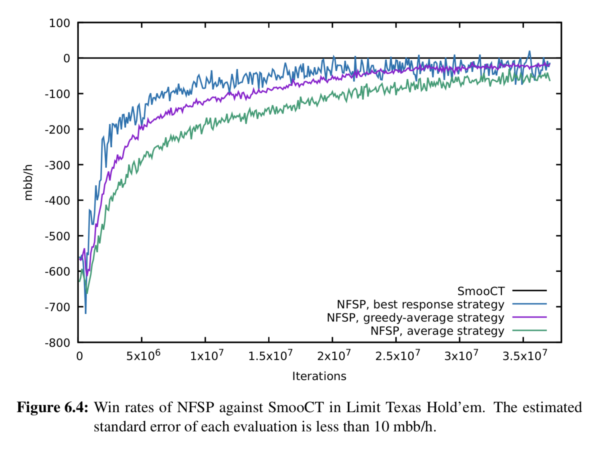

Limit Texas Hold’em,  neural networks were fully connected with four hidden layers of 1024,512,1024 and 512 neurons with rectified linear activations.  memory sizes were set to 600k and 30m for MRL and MSL .  vanilla SGD , earning rates set to 0.1 and 0.01.  Each agent performed 2 stochastic gradient updates of mini-batch size 256 per network for every 256 steps in the game. The target network was refitted every 1000 updates. NFSP’s anticipa- tory parameter was set to η = 0.1. The ε -greedy policies’ exploration started at 0.08 and decayed to 0. 

periodically evaluated NFSP’s performance against SmooCT from symmetric play for 25000 hands each.

图6.4给出了NFSP的学习性能。NFSP的average and greedy-average strategy表现出稳定且相对单调的性能提升 ; 而BR策略表现出较多的噪声性能

http://jmlr.org/proceedings/papers/v37/heinrich15.pdf

