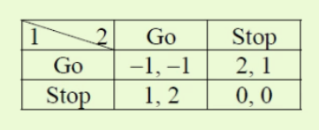
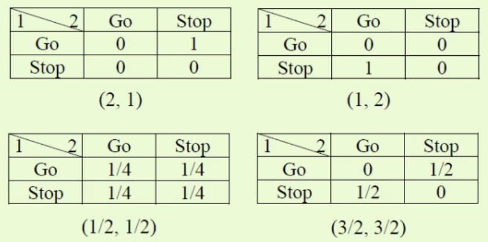
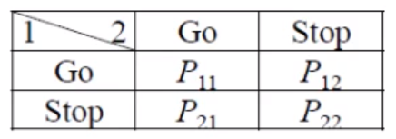
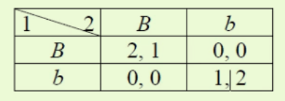
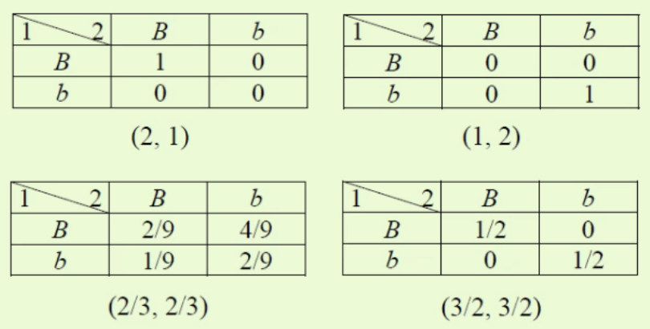
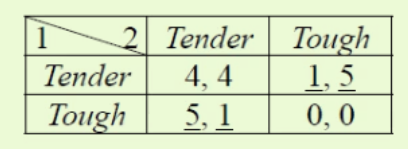
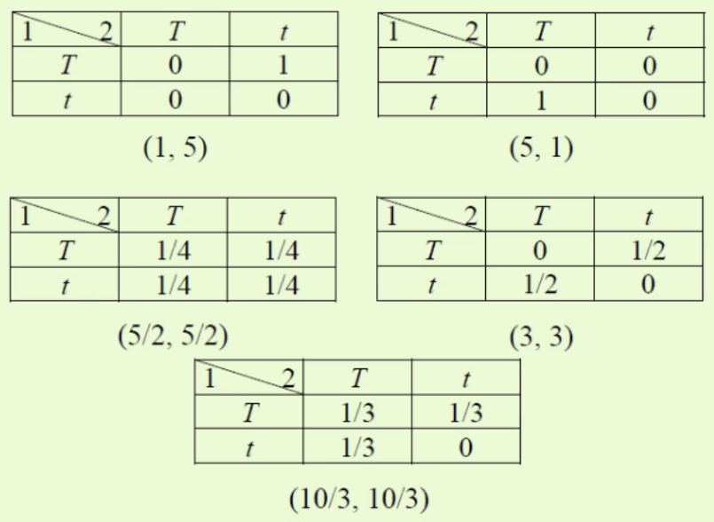
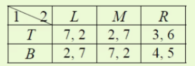
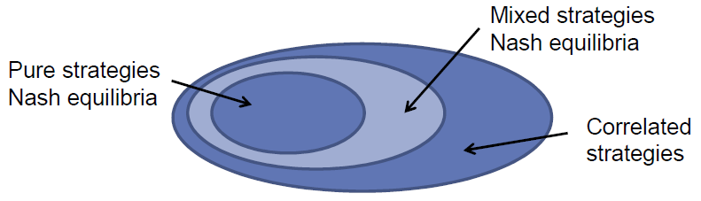

# Regret Matching

## A SIMPLE ADAPTIVE PROCEDURE LEADING TO CORRELATED EQUILIBRIUM

## CORRELATED EQUILIBRIA

### Games with communication

- To solve "inefficiency" and "non-uniqueness" of the Nash equilibrium : **communication** among players
- **Communication**  !=  **Cooperation**
- The introduction of communication among players can lead to a **Selfenforcing equilibrium** (without binding agreement) 自我执行均衡

**相关策略**: 纯策略所有可能组合中的一种.  A **correlated strategy** or **jointly randomized strategy** for a set of players $C \subseteq N$ is any probability distribution $\alpha$ over the set of possible combinations of pure strategies these players can choose, i.e. $\alpha \in \Delta\left(S_{c}\right)=\Delta\left(\times_{i \in C}\left(S_{i}\right)\right)$    

用 $\Delta\left(Q\right)$ 表示 the **set** of **probability distributions** over a finite set $Q$  ,  集合Q中元素的所有概率分布的集.

#####  Correlated strategy profile vs Mixed strategy profile

- Correlated strategy profile:  $\alpha \in  \Delta\left(\times \left(S_{i}\right)\right)$  , 纯策略组合的 概率分布
- Mixed strategy profile: $\alpha \in   \times \Delta  \left(S_{i}\right)$  ,  纯策略概率分布(混合策略)的 组合

纳什均衡, 两个人的混合策略是独立的;   相关均衡允许两个人的混合策略相关. In a correlated strategy the mixed strategies can be correlated

### Correlated Equilibria (Aumann, 1974)

A correlated strategy $\alpha$ can be implemented by the players through a **mediator** which recommends
randomly a profile of pure strategies according to $\alpha$

"Any correlated strategies for the players which could be self-enforcingly implemented with the help of a mediator who makes non binding recommendations to each player"

- Refinement of the mixed Nash equilibrium
- Includes communication among players (public signal/ recommended strategy)

Consider an extended game:

- An **observer** recommends to each player a pure strategy that he should play.   外面有一个随机装置, 对应着纯策略. 观察者通过该随机装置来提建议. 如果两个人有两个纯策略, 则对应4个结果, 则该随机装置也有4个结果. 
- The vector of recommended strategies is chosen by the observer according to a **commonly known** probability distribution over the set of pure strategy vectors. 所有人都知道这个随机装置的概率分布, 共同知识; 大家不知道随机装置某次的结果,但知道其概率分布. 
- This probability distribution is a **correlated equilibrium** if the strategy vector in which all players follow the observer's recommendations is a Nash equilibrium of the extended game. 遵从建议可以达到纳什均衡的时候, 该建议是相关均衡.
- The players' choices of pure strategies may be correlated since they use the **same** random events in deciding which pure strategy to play.  每个人的策略与同一个随机装置相关.

### The Traffic Game

十字路口, 谁先行.

3个纳什均衡:  (S,G) , (G,S),  (1/2 G + 1/2 S, 1/2 G + 1/2 S)
收益分别为 : (2,1) , (1,2), (1/2, 1/2)

3个均衡都不好,  可以约定成俗, 南北先走, 大家自愿遵守,  但总有一个亏, 不公平; 混合策略 是 帕累托无效,可以被两个纯策略均衡改进. 

所以设置一个红绿灯.   有四个结果,  
红绿灯设置为, 1方看红,另外必看绿, 可以去掉(G,G),(S,S)两个; 然后红绿出现的概率是1/2,
得到一个相关均衡, 使得 双方会自动遵守规则, 因为如果不遵守, 必然会造成自己收益下降.

​	

 看到最后相关均衡的收益, 无法被帕累托改进(从一种分配状态到另一种状态的变化中，在没有使任何人境况变坏的前提下，使得至少一个人变得更好), 所以是帕累托有效. 

数学表达为, 下面的这套符号有个不好的地方, 是把玩家的历史表示为$a$, 策略表示为$a_i$ ; 下面的状态就是策略,策略组合,没严格区分: 

- (随机装置的结果的)状态空间 set of state  $$\Omega=\left\{\omega_{1}, \omega_{2}, \omega_{3}, \omega_{4}\right\}=\{G G, G S, S G, S S\}=A$$  , 这里state, 即随机装置的结果, 对应着一个行动组合;  状态空间对应着策略组合集
- 每个人的信息集是 状态空间的一个**信息分割information partition** , 互不相交  $$\forall i \in N, \mathcal{H}_{i}=\left\{h_{i} \mid \exists a_{i} \in A_{i}, h_{i}=\left\{a_{i}\right\} \times A_{-i}\right\}$$  ,  自己的每个act 与 别人行动集的 笛卡尔积, 因为不知道其他人的行动 , 
- P1: $$\mathcal{H}_{1}=\left\{h_{11}, h_{12}\right\}=\{\{G G, G S\},\{S G, S S\}\}$$   ; GS表示P1选G,P2选S
- P2: $$\mathcal{H}_{2}=\left\{h_{21}, h_{22}\right\}=\{\{G G, SG\},\{G S, S S\}\}$$  ; 该例,1个信息分割里面有2个信息集, 每个信息集包含2个状态(结果)
- 专家的**建议**就是 随机装置的状态空间上的一个概率分布 probability measure,   $$P \in \Delta(\Omega)=\Delta(A)=\left\{\pi: A \rightarrow[0,1] \mid \sum_{a \in A} \pi(a)=1\right\}$$  is called a  **recommendation**. 
- 红绿灯的建议 $$ P(G G)=P(S S)=0, P(G S)=P(S G)=0.5 $$ 
    专家,对GS,GS抛硬币,根据抛硬币的结果, 比如这次是GS, 则让P1选G,让P2选S

- **事件** 是状态空间的一个子集,  事件的概率就是每个状态发生的概率和  $$\forall E \subseteq A, P(E)=\sum_{a \in E} P(a)$$
- 条件概率: $$\forall i \in N, \forall h_{i} \in \mathcal{H}_{i}$$ with  $$P\left(h_{i}\right)>0, \forall a \in h_{i}$$ , $h_{i}$是状态空间的子集,所以也是个事件,当该事件发生概率>0时,  
  $$P\left(a \mid h_{i}\right)=\frac{P(a)}{P\left(h_{i}\right)}$$    
- 每个人的相关策略空间: $$\forall i \in N,$$ let $$\Sigma_{i}=\left\{\sigma_{i}: A \rightarrow A_{i} \mid \forall h_{i} \in \mathcal{H}_{i}, \forall a, b \in h_{i} , 
    \sigma_{i}(a)=\sigma_{i}(b)\right\}$$  相关策略空间是一个函数, 定义域是状态空间;输出的是某个玩家的状态空间,建议各个玩家,应该做什么, 后面是限制条件, 在同一个信息集里, 策略是一样的.    
- 如果各个玩家遵循了建议, 使用特殊的符号 $$\sigma_{i}^{*}$$来表示玩家的策略.  
    Let $$\sigma_{i}^{*} \in \Sigma_{i}$$ s.t. $$\forall h_{i} \in \mathcal{H}_{i}, \forall a \in h_{i}, \sigma_{i}^{*}(a)=a_{i}$$  , 则玩家在信息集上选的act是一样,都是上面专家建议根据概率P让选的$a_i$

一个建议P是相关均衡: 是对各个玩家, 每个信息集上, 都遵循 相关策略$\sigma_{i}^{*}$, 收益是最优的. 

The recommendation $P$ is a **correlated equilibrium** , 
iff $$\forall i \in N, \forall h_{i} \in \mathcal{H}_{i}$$ with $$P\left(h_{i}\right)>0, \forall \sigma_{i} \in \Sigma_{i}$$

$$
\mathbf{E}_{P}\left(u_{i}\left(\sigma_{i}^{*}, \sigma_{-i}^{*} \mid h_{i}\right)\right) \geq \mathbf{E}_{P}\left(u_{i}\left(\sigma_{i}, \sigma_{-i}^{*} \mid h_{i}\right)\right)
$$

i.e. $$ \begin{array}{c} \sum_{a \in h_{i}} P\left(a \mid h_{i}\right) u_{i}\left(\sigma_{i}^{*}(a), \sigma_{-i}^{*}(a)\right) \geq  
\sum_{a \in h_{i}} P\left(a \mid h_{i}\right) u_{i}\left(\sigma_{i}(a), \sigma_{-i}^{*}(a)\right)
\end{array} $$  在每个信息集上展开

因为自己的信息集上, 自己的act是确定的, since $$h_{i}=\left\{a_{i}\right\} \times A_{-i}$$ for some $$a_{i} \in A_{i}$$, we have  

$$
\sum_{a_{-i} \in A_{-i}} P\left(a_{i}, a_{-i} \mid h_{i}\right) u_{i}\left(\sigma_{i}^{*}\left(a_{i}, a_{-i}\right), \sigma_{-i}^{*}\left(a_{i}, a_{-i}\right)\right) \geq \\ \sum_{a_{-i} \in A_{-i}} P\left(a_{i}, a_{-i} \mid h_{i}\right) u_{i}\left(\sigma_{i}\left(a_{i}, a_{-i}\right), \sigma_{-i}^{*}\left(a_{i}, a_{-i}\right)\right)
$$

又因为大家都遵循建议$\sigma_{i}^{*}(a)=a_{i}$, i.e. $P$ is a **correlated equilibrium** ,  

$$
\begin{array}{c}
\sum_{a_{-i} \in A_{-i}} P\left(a_{i}, a_{-i} \mid h_{i}\right) u_{i}\left(a_{i}, a_{-i}\right) \geq  
\sum_{a_{-i} \in A_{-i}} P\left(a_{i}, a_{-i} \mid h_{i}\right) u_{i}\left(\sigma_{i}\left(a_{i}, a_{-i}\right), a_{-i}\right)
\end{array}
$$

同时得到一个等价的, 如果 $P$ is a **correlated equilibrium** , 玩家i不再遵从建议, 有  
iff $$\forall i \in N, \forall h_{i} \in \mathcal{H}_{i}$$ with $$P\left(h_{i}\right)>0$$  and $$h_{i}=\left\{a_{i}\right\} \times A_{-i}$$ ,  $$\forall b_{i} \in A_{i}$$  ,

$$
\begin{array}{c}
\sum_{a_{-i} \in A_{-i}} P\left(a_{i}, a_{-i} \mid h_{i}\right) u_{i}\left(a_{i}, a_{-i}\right) \geq  
\sum_{a_{-i} \in A_{-i}} P\left(a_{i}, a_{-i} \mid h_{i}\right) u_{i}\left(b_{i}, a_{-i}\right)
\end{array}
$$

又由于 不等式两边都是在同一个信息集上比较, 条件概率的分母是一样的, 可以约掉, 得到

$$
\begin{array}{c}
\sum_{a_{-i} \in A_{-i}} P\left(a_{i}, a_{-i} \right) u_{i}\left(a_{i}, a_{-i}\right) \geq  
\sum_{a_{-i} \in A_{-i}} P\left(a_{i}, a_{-i} \right) u_{i}\left(b_{i}, a_{-i}\right)
\end{array}
$$

下面求一下 上例的  相关均衡:

$$
\begin{array}{l}
P_{11} u_{1}(G, G)+P_{12} u_{1}(G, S) \geq P_{11} u_{1}(S, G)+P_{12} u_{1}(S, S) \\
P_{21} u_{1}(S, G)+P_{22} u_{1}(S, S) \geq P_{21} u_{1}(G, G)+P_{22} u_{1}(G, S) \\
P_{11} u_{2}(G, G)+P_{21} u_{2}(S, G) \geq P_{11} u_{2}(G, S)+P_{21} u_{2}(S, S) \\
P_{12} u_{2}(G, S)+P_{22} u_{2}(S, S) \geq P_{12} u_{2}(G, G)+P_{22} u_{2}(S, G)
\end{array}
$$

$$
\begin{array}{l}
P_{11} \times(-1)+P_{12} \times 2 \geq P_{11} \times 1+P_{12} \times 0 \\
P_{21} \times 1+P_{22} \times 0 \geq P_{21} \times(-1)+P_{22} \times 2 \\
P_{11} \times(-1)+P_{21} \times 2 \geq P_{11} \times 1+P_{21} \times 0 \\
P_{12} \times 1+P_{22} \times 0 \geq P_{12} \times(-1)+P_{22} \times 2
\end{array}
$$

得到所有的相关均衡集:
$$
\begin{array}{l}
\left\{\left(P_{11}, P_{12}, P_{21}, P_{22}\right) \in[0,1]^{4}  \mid P_{12} \geq P_{11}, P_{21} \geq P_{22}, P_{21} \geq 
 P_{11}, P_{12} \geq P_{22},\\ P_{11}+P_{12}+P_{21}+P_{22}=1\right\}
\end{array}
$$

再最早之前得到的均衡

可以验证, 纳什均衡肯定是相关均衡.  混合策略均衡也是相关均衡. 

对于相关均衡, 要么是唯一的,要么就是无数的.

另一个例子:  sex battle

3 Nash equilibria:
$$
(B, B),(b, b),\left(\frac{2}{3}[B]+\frac{1}{3}[b], \frac{1}{3}[B]+\frac{2}{3}[b]\right)
$$

equilibrium payoffs:
$$
(2,1),(1,2),\left(\frac{2}{3}, \frac{2}{3}\right)
$$
跟上例一样,  帕累托有效的均衡,不公平. 
$$
\begin{aligned}
&\begin{array}{l}
P_{11} \times 2+P_{12} \times 0 \geq P_{11} \times 0+P_{12} \times 1 \\
P_{21} \times 0+P_{22} \times 1 \geq P_{21} \times 2+P_{22} \times 0 \\
P_{11} \times 1+P_{21} \times 0 \geq P_{11} \times 0+P_{21} \times 2 \\
P_{12} \times 0+P_{22} \times 2 \geq P_{12} \times 1+P_{22} \times 0
\end{array}\\
&\text {  set of correlated equilibria: }\\
&\left\{\left(P_{11}, P_{12}, P_{21}, P_{22}\right) \in[0,1]^{4} \mid 2 P_{11} \geq P_{12}, P_{22} \geq 2 P_{21}, P_{11}
\geq 2 P_{21},  \\2 {P}_{22} \geq P_{12}, P_{11}+P_{12}+P_{21}+P_{22}=1\right\}
\end{aligned}
$$

例子:  Game of Marriage

3 Nash equilibria:  混合策略是帕累托有效, 但可能造成离婚,右下角
$$
(T, t),(t, T),\left(\frac{1}{2}[T]+\frac{1}{2}[t], \frac{1}{2}[T]+\frac{1}{2}[t]\right)
$$
equilibrium payoffs:
$$
(1,5),(5,1),(5 / 2,5 / 2)
$$

最下面1/3抽签的相关策略, 比抛硬币的相关策略要好. 

$$
\begin{aligned}
&\begin{array}{l}
P_{11} \times 4+P_{12} \times 1 \geq P_{11} \times 5+P_{12} \times 0 \\
P_{21} \times 5+P_{22} \times 0 \geq P_{21} \times 4+P_{22} \times 1 \\
P_{11} \times 4+P_{21} \times 1 \geq P_{11} \times 5+P_{21} \times 0 \\
P_{12} \times 5+P_{22} \times 0 \geq P_{12} \times 4+P_{22} \times 1
\end{array}\\
&\text { The set of correlated equilibria: }\\
&\left\{\left(P_{11}, P_{12}, P_{21}, P_{22}\right) \in[0,1]^{4} \mid P_{12} \geq P_{11}, P_{21} \geq P_{22}, P_{21} \geq\right.\\
&\left.P_{11}, P_{12} \geq P_{22}, P_{11}+P_{12}+P_{21}+P_{22}=1\right\}
\end{aligned}
$$
在相关均衡集里面找到大家利益最大化的那个, 就是**社会最优契约.**  相关均衡可以看出一个契约.

 

例 

只有混合均衡  (1/3, 2/3) ,(1/6,0,5/6)

收益为  (11/3, 16/3)

